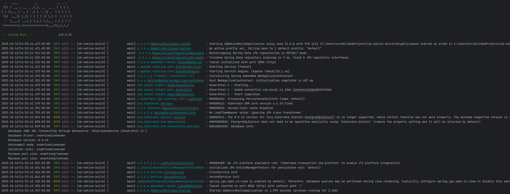

# Spring Boot Native Example

Este projeto é um exemplo de aplicação Spring Boot com suporte a **Native Build** utilizando **Docker + GraalVM**. 
Nele foi adicionado uma conexão com um banco de dados para mostrar um exemplo de uso de uma API com banco de dados, onde geralmente é algo que pode dar uma atrasada no cold start.

## 🚀 Objetivo do Projeto
O objetivo é demonstrar a diferença de performance entre Native Build e JVM, onde o build como nativo trouxe um cold start de **2.3s** para **0.1s**. Lembrando que esse tempo pode variar de acordo com o hardware e o ambiente.

* Rodar a aplicação **normalmente (JVM)** via IntelliJ.
* Rodar a aplicação **compilada nativamente** em um container Docker.

## 📦 Pré-requisitos

Certifique-se de ter instalado:

* **Docker** e **Docker Compose**
* **Java 21+** (apenas se quiser rodar via IntelliJ)
* **Maven** (opcional para build manual)

---

## 🛠️ Como Rodar Localmente (JVM - IntelliJ)

1. Abra o projeto no **IntelliJ IDEA**.
2. Rode diretamente a classe principal (`main`).
3. A aplicação iniciará normalmente utilizando a JVM.

> 📸 *Print da inicialização no IntelliJ (sem build nativo)*

---

## 🐳 Rodando com Docker (Native Build)

### 1️⃣ Build da imagem Docker

Antes de rodar o `docker-compose`, execute o build:

```bash
docker build -t sb-native-build .
```

### 2️⃣ Subir API + Banco de Dados

```bash
docker-compose up --build
```

Após subir, a API estará disponível em: **[http://localhost:8080](http://localhost:8080)**

> 📸 *Print rodando em container com build nativo*

---

## 🧠 Observações

* O **build nativo** gera um **binário executável**, não um `.jar`.
* O tempo de inicialização é drasticamente menor em modo nativo. Excelente para uso em serveless como exemplo.